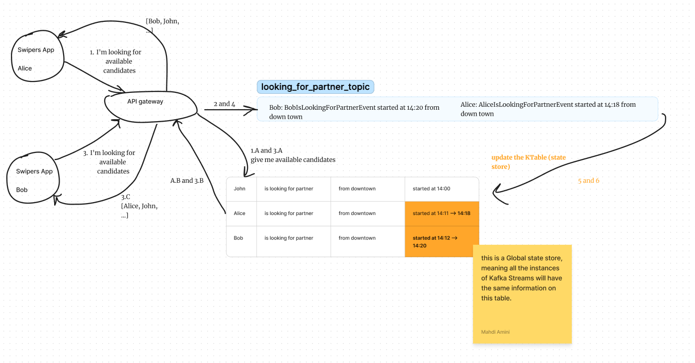

# Events, my dear boy, events.

## How to capture two people liking each other, only with events, in order to announce them matched? (Event-Driven match making)

### Story
Alice, Bob and John are scrolling through a match-making app.
They are looking at people (candidates) living close enough, liking and unliking them.
At some point, Alice likes Bob.
Later Alice dislikes John.
A few minutes later, Bob likes Alice too.
Boom, the app now tells Alice and Bob that they have mutually liked each other (matched).

### Context
 - All we have are events and state stores.
 - We are going to use KafkaStreams and stream processing notions. 
 - I assume you know enough about them, apart from general knowledge of Event-Driven systems.
 - This post is not about stream processing being a good or bad approach here. Rather, a thought experiment on Event-Driven systems.

### Event storming
 - Alice is swiping left and right through available* candidates.
 - Alice likes Bod
 - Alice dislikes John
 - Bob likes Alice (likes back)
 - Alice and Bob are matched

       *Available candidates are people who are doing the same, swiping. 
       There can be a time difference between when each person starts swiping. But as long as it's not too different, it should still be considered availablity.
       Other parameters, like The location from which has started swiping, can be used to limit who is available to whom. 
       In this post, we skip all of them as they can be handled without introducing a change to the overall system design.

 - Bob is liked by Alice (passive version of Alice like Bob event)

### Common language
 - People who are using the application and looking for a partner are users of the application.
        During the time that they are swiping and not concerned with their matches, we can call them `swiper`. 
        In the context of managing matches, we can come up with a different name. But that part is outside the context of this post.
 - When a `Swiper` likes someone, we call him/her `Liker` . 
 - When a `Swiper` is liked by someone, we call him/her `Likee` .

### Event definitions
 - SwiperStartedLookingForPartner(String swiper, location, time, ...) ===> key: swiper
        This event can be considered an `update`. Which means we don't care about keeping a history of it. We just care about the latest version of it.
 - SwiperLikedAnotherSwiper(String liker, String likee) ===> key: liker
 - SwiperIsLikedByAnotherSwiper(String likee, String liker) ===> key: likee
 - SwiperIsMatchedWithAnotherSwiper(String matchPartyA, String matchPartyB) ===> key: matchPartyA
    
        All the mentions of `swiper`, `likee`, `liker` and `matchParty` in the events above, are user identifier of the user playing the corresponding role.

### KTables
 - (Global) AvaiableSwippers: created using SwiperStartedLookingForPartner events. Serves who is available atm.
 - LikeHistory: created using SwiperLikedAnotherSwiper events. For each `liker`, we will keep a list of users the `liker` has liked.
 - For each SwiperLikedAnotherSwiper event, publish a SwiperIsLikedByAnotherSwiper. 
 - LikedByHistory: Created using SwiperIsLikedByAnotherSwiper events. For each `likee`, we will keep a list of users the `likee` has been liked by.

### General idea
   The only execution that happens in the system is when an event happens.
    So the triggers for our actions are the events.

   Match, here, means the following:
     When Bob likes Alice, there will be a match only when Alice has already liked Bob.
     We know if Alice has already liked Bob (or not) by looking at LikeHistory.
     But we can't randomly look at that table; for each SwiperLikedAnotherSwiper, or in general.
     We need to look at that table only when there is a possibility of match.
   Here that possibility exists when Bob likes Alice.
     So when Bob likes Alice, we use that as a trigger to start checking if Alice has previously liked him too.
     During our check, we can't just query the LikeHistory.
     That would NOT be completely real-time and streaming style, hence the blocking query.
   What we need is a way to turn that trigger into something else that gives us access to Alice LikeHistory, without a blocking query.
     One option is to **join** an event (stream) with LikeHistory table.
     The event key should be Alice so that when join happens, the join operation gets access to Alice's history of likes.
     The join operation also needs to know who's the other party; who to look for inside Alice's history of likes.
   The initial trigger was BobLikedAlice event. This event has the wrong key for our join since the key is Bob. 
     However, it has all the information we need to publish a new trigger, AliceIsLikedByBob event.
     So when we receive it, we just turn it around and publish AliceIsLikedByBob event. The key of this new event is Alice.
     Now we have the trigger we were looking for with the right key. Let's join AliceIsLikedByBob event with LikeHistory Ktable.
  In the join operation, we check if Bob is already liked by Alice. If yes, match. Otherwise, ignore.
     If matched, we publish two events right away: SwiperIsMatchedWithAnotherSwiper(Alice, Bob) and SwiperIsMatchedWithAnotherSwiper(Bob, Alice)
    There two events are similar but have different keys. They will fill up the MatchHistory of their corresponding key (user).
    

1. SwiperLikedAnotherSwiper(Alice, Bob) => LikeHistory: (Alice[Bob], Bob[])
2. SwiperIsLikedByAnotherSwiper(Bob, Alice) event published
3. SwiperIsLikedByAnotherSwiper(Bob, Alice) joins LikeHistory: (Alice[Bob], Bob[]) ==> Bob like history doesn't include `SwiperIsLikedByAnotherSwiper` ==> no match 
4. SwiperLikedAnotherSwiper(Bob, Alice) => LikeHistory: (Alice[Bob], Bob[Alice])
5. SwiperIsLikedByAnotherSwiper(Alice, Bob) event published
6. SwiperIsLikedByAnotherSwiper(Alice, Bob) joins LikeHistory: (Alice[Bob], Bob[Alice]) ==> Bob like history contains Alice.
7. SwiperIsMatchedWithAnotherSwiper(Alice, Bob) and SwiperIsMatchedWithAnotherSwiper(Bob, Alice) are published
 
### Illustration
#### Candidate look up 

#### Liked but no match yet

